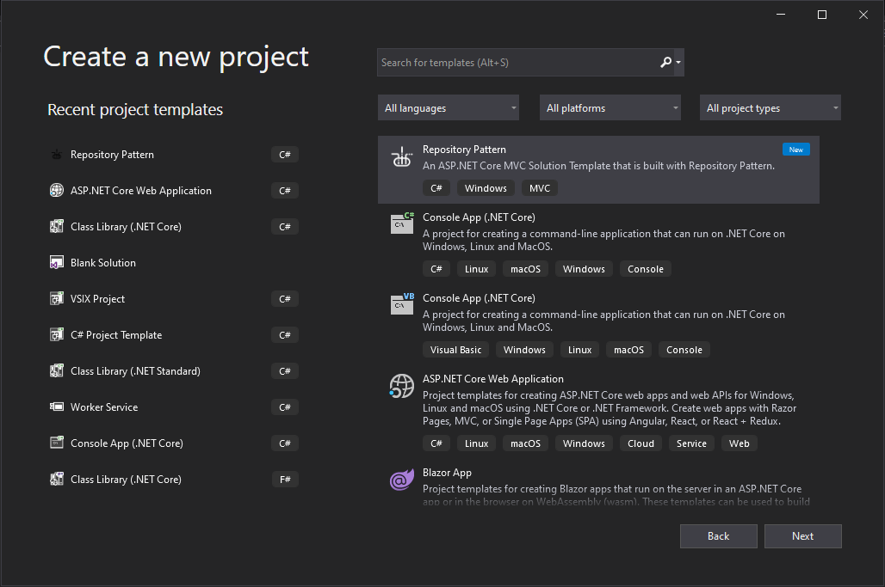
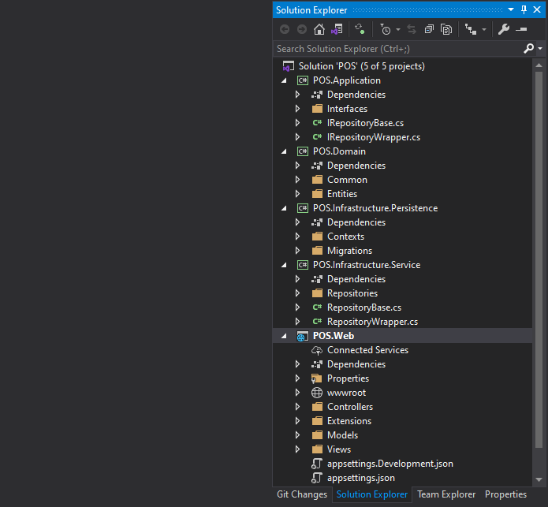

# Repository Pattern

   
  
  
  
  

 

An Implementation of Repository Pattern with ASP.NET Core 3.1 Web MVC. With this Open-Source Template, we create an abstraction layer between the data access and the business logic layer of an application. By using it, we are promoting a more loosely coupled approach to access our data from the database. Also, the code is cleaner and easier to maintain and reuse. Data access logic is in a separate class, or sets of classes called a repository, with the responsibility of persisting the application’s business model.

Check out the [GitHub](https://github.com/raihanM95/RepositoryPattern) to learn more about this Open Source Project.

## Getting Started

### Download the Extension
Make sure Visual Studio 2019 is installed on your machine with the latest SDK.
[Download from Visual Studio Marketplace](https://marketplace.visualstudio.com/items?itemName=RaihanMahmud.RepositoryPattern). Install it on your machine.

Follow these Steps to get started.

Your Solution Template is Ready!

Next, open up Web/appsettings.json to change the connection strings and Run these commands to update the database.

`update-database`

## Technologies

- ASP.NET Core 3.1 Web
- .NET Core 3.1 Libraries

## Prerequisites

- Visual Studio 2019 Community and above
- .NET Core 3.1 SDK and above
- Basic Understanding of Architectures and Clean Code Principles

## About the Author

### Raihan Mahmud

- Facebook Page - [Raihan Mahmud RAM](https://www.facebook.com/raihanmahmudofficial)
- Facebook - [Raihan Mahmud RAM](https://www.facebook.com/raihanM95)
- Twitter - [Raihan Mahmud RAM](https://twitter.com/raihanM95)
- Linkedin - [Raihan Mahmud RAM](https://www.linkedin.com/in/raihanM95)

## Licensing

raihanM95/RepositoryPattern Project is licensed with the [MIT License](https://github.com/raihanM95/RepositoryPattern/blob/main/LICENSE).
